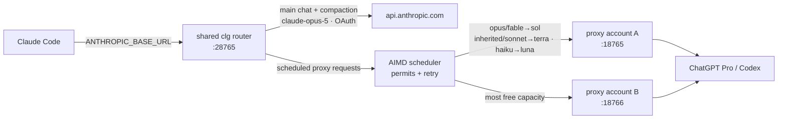

# clg — hybrid Claude Code launcher

Run Claude Code with a **real Anthropic Opus main thread** (full 1M context, native
compaction) while **every subagent is served by GPT models** through
[claude-code-proxy](https://github.com/raine/claude-code-proxy) (ChatGPT Pro / Codex
backend). The default shared router schedules each proxy request across every
authenticated account with adaptive per-account concurrency and targeted retries.

Why: proxied GPT models struggle with Claude Code's harness (compaction, orchestration),
and pure-Anthropic burns your subscription on bulk subagent work. `clg` gives you the
best of both — the orchestrator is a genuine Anthropic model, the worker fleet is GPT.



## Model routing

| Surface | Model | Served by |
|---|---|---|
| Main chat | `claude-opus-5[1m]` (1M context) | api.anthropic.com (your Claude OAuth) |
| Compaction | `claude-opus-5` | api.anthropic.com |
| Subagents `opus` / `fable` | `gpt-5.6-sol` | proxy |
| Subagents `sonnet` | `gpt-5.6-terra` | proxy |
| Subagents `haiku` | `gpt-5.6-luna` | proxy |
| Subagents with **no model** (inherited) — native *and* custom agents | `gpt-5.6-terra` | proxy |

The router tells the main thread apart from inherited-model subagents by the
request's system prompt (whitelist, fail-safe: anything unrecognized or malformed goes
to GPT, never to your Anthropic quota). It accepts one exact trailing `[1m]` suffix only.
Every request is logged as a `route …` line, including the chosen upstream and attempt
number, in `~/.local/state/claude-code-proxy/clg-router-shared.log`.

The `[1m]` suffix matters: without it Claude Code clamps non-first-party auth to a 200k
window and compacts constantly. Opus 5 is natively 1M and the API serves it over
subscription OAuth.

## Requirements

- Claude Code with an active Claude subscription (`claude` logged in — the router reads
  the OAuth token from the macOS Keychain / `~/.claude/.credentials.json` at request time)
- [claude-code-proxy](https://github.com/raine/claude-code-proxy) with at least one
  authenticated Codex account
- Python 3.10+

## Install

```sh
git clone https://github.com/momomuchu/clg && cd clg
./install.sh   # symlinks bin/* into ~/.local/bin
```

## Usage

```sh
clg                    # shared router across every authenticated account
clg @auto              # same shared-router behavior explicitly
clg @b                 # pin account "b" for debugging
clg @list              # accounts + proxy + router + Anthropic OAuth status
clg-account add b      # add a ChatGPT Pro account (device-code login)
clg-fleet -j 3 p1.txt p2.txt   # batch `clg -p` runs
```

Each account gets its own proxy instance (isolated `CCP_CONFIG_DIR`). The default shared
router listens on port `28765`, starts every authenticated account proxy, and picks the
upstream with the most free capacity for each generation request. Each upstream starts
with 6 permits. A WebSocket-upgrade 403 reduces that upstream's permits by 25% (floor 2)
and is retried only when a different account has capacity. Every 20 consecutive completed
generation responses adds one permit (ceiling 12, without lowering explicitly higher
settings). `POST /v1/messages/count_tokens`, `GET /v1/models`, and other non-generation
requests bypass generation permits and AIMD. Requests are capped at 64 MiB and socket
reads time out after 600 seconds. Main-chat Anthropic traffic bypasses this scheduler.

`clg @name` preserves a pinned-session URL on `account port + 10000`, but that listener
is a compatibility relay to the shared router: it pins proxy traffic to `@name` while the
shared router remains the sole owner of permits and AIMD state.

`GET /__clg` reports the configured upstream set plus each upstream's permits, in-flight
count, free capacity, and current success streak.

## Caveats

- If the Claude OAuth token expires (long stretches without a normal `claude` session),
  main-chat requests fail — `clg` warns at launch; run `claude` once to refresh.
- A `fork`-type subagent inherits the parent model verbatim and its system prompt looks
  like the main thread's, so it may reach Anthropic.
- The system-prompt whitelist tracks Claude Code's internal prompts; if a CLI update
  rewords them, traffic falls back to GPT (visible in the router log), never the other
  way around.

## License

MIT
